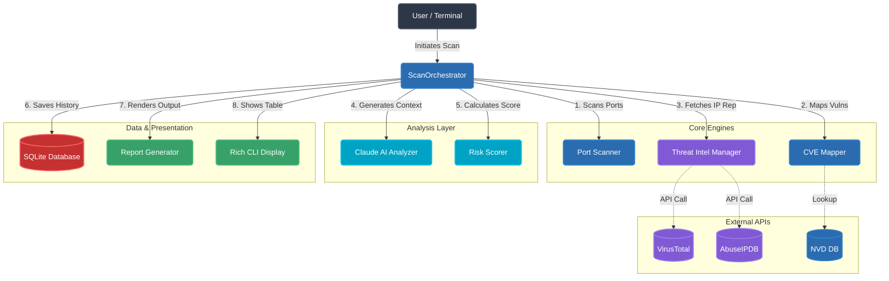

<div align="center">
  
  

  # SentinelRecon AI 🛡️

  **Enterprise-Grade AI-Powered Network Reconnaissance & Threat Intelligence Toolkit**
  
  *An advanced security auditor that performs intelligent port scanning, real-time threat intelligence correlation (AbuseIPDB, VirusTotal), CVE mapping, and AI-driven vulnerability remediation.*

  [](https://www.python.org/)
  [](https://anthropic.com/)
  [](LICENSE)
  []()

  [🚀 Quick Start](#-quick-start) • [📚 Architecture](#%EF%B8%8F-architecture) • [⚙️ Configuration](#%EF%B8%8F-configuration) • [🤝 Contribute](#-contributing)

</div>

---

## 🎯 Key Features at a Glance

| 🔍 Intelligent Recon | 🚨 Threat Intelligence | 🤖 AI Analysis | 📊 Enterprise Reports |
| :--- | :--- | :--- | :--- |
| **Multi-mode Scanning** (SYN, Connect, UDP) with service/banner grabbing. | **Real-time API Checks** via AbuseIPDB and VirusTotal to detect malicious IPs. | **Claude Integration** to provide context-aware risk scoring and remediation steps. | **Beautiful UI/UX** with Rich Terminal outputs and HTML/PDF Jinja2 Reports. |

---

## 📑 Table of Contents
- [Disclaimer](#%EF%B8%8F-disclaimer)
- [Quick Start](#-quick-start)
- [Usage Guide](#-usage-guide)
- [Architecture](#%EF%B8%8F-architecture)
- [Configuration](#%EF%B8%8F-configuration)
- [Repository Structure](#-repository-structure)

---

## ⚠️ Disclaimer
> **SentinelRecon AI is designed strictly for authorized security auditing, defensive analysis, and CTF environments.** Scanning third-party networks without explicit, written consent is illegal and unethical. The developers assume no liability for misuse.

---

## 🚀 Quick Start

### 1. Prerequisites
- **Python 3.9+**
- For PDF Report Generation, you must have [WeasyPrint dependencies (GTK3)](https://doc.courtbouillon.org/weasyprint/stable/first_steps.html#installation) installed on your system. 

### 2. Installation
```bash
git clone https://github.com/shlok926/SentinelReconAI.git
cd SentinelReconAI
pip install -r requirements.txt
```

---

## 💻 Usage Guide

SentinelRecon is executed via a powerful CLI interface.

### Basic Scan
Scan a target using default options (Ports 1-1024):
```bash
python -m sentinelrecon.cli.main scan --target 192.168.1.1
```

### Advanced Scan
Scan specific ports, skip AI, and output professional reports to a custom directory:
```bash
python -m sentinelrecon.cli.main scan --target scanme.nmap.org --ports 22,80,443 --type connect --no-ai --output ./my_reports
```

*Note: Threat Intelligence queries are automatically skipped for private/local IP ranges to save your API quota.*

---

## ⚙️ Configuration

SentinelRecon relies on API keys for Threat Intel and AI features. Create a `.env` file in the root directory:

```bash
cp .env.example .env
```
Edit the `.env` file and add your keys (All are optional, but required for advanced features):
```env
# AI Analysis (Optional but recommended)
CLAUDE_API_KEY="your-anthropic-key-here"

# Threat Intelligence (Optional, Free)
ABUSEIPDB_API_KEY="your-abuseipdb-key-here"
VT_API_KEY="your-virustotal-key-here"
```

---

## 🏗️ Architecture



---

## 📁 Repository Structure
```text
SentinelReconAI/
├── sentinelrecon/
│   ├── cli/            # Rich Terminal Interface (Commands & Display)
│   ├── core/           # Port Scanner & Threat Intel Managers
│   ├── data/           # SQLite Database Operations
│   ├── reports/        # HTML/PDF Jinja2 Report Generators
│   └── analysis/       # AI Integration & Risk Scoring
├── output/             # Generated HTML/PDF Reports go here
└── .env.example        # Environment Variables Template
```

---

## 🤝 Contributing
Contributions, issues, and feature requests are welcome!
Feel free to check the [issues page](https://github.com/shlok926/SentinelReconAI/issues).

## 📝 License
This project is [MIT](LICENSE) licensed.
