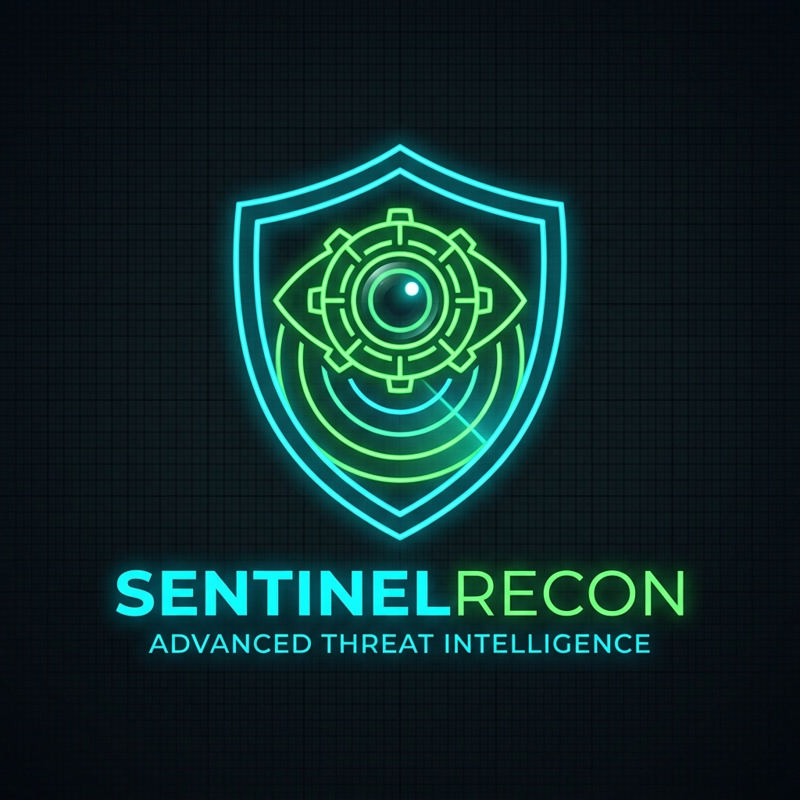
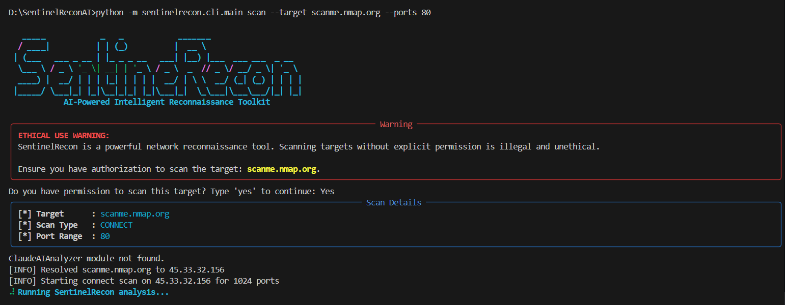
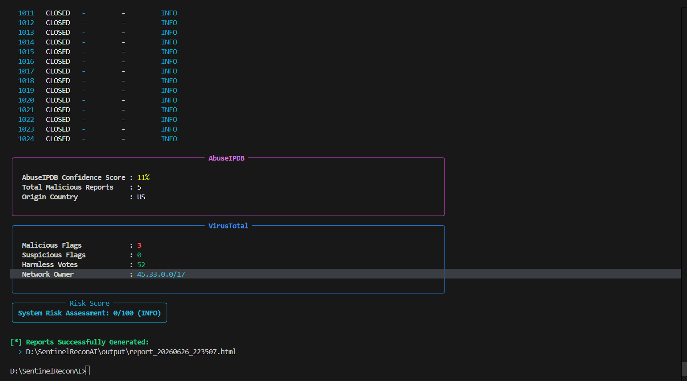
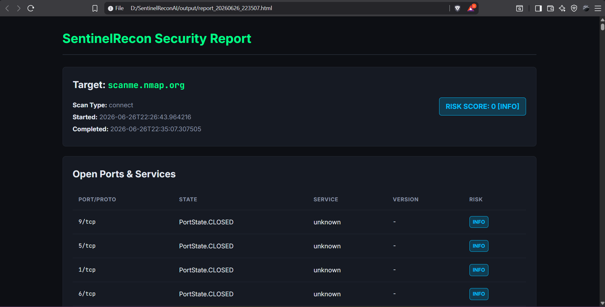
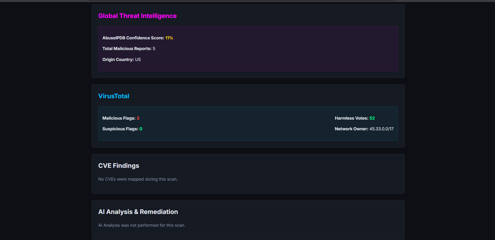
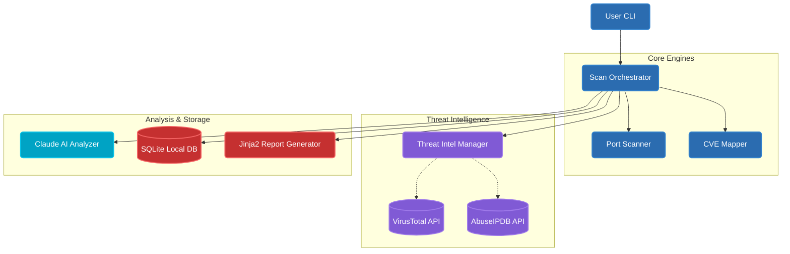

<div align="center">
  
  

  # SentinelRecon AI

  **Enterprise-Grade AI-Powered Network Reconnaissance & Threat Intelligence Toolkit**

  [](https://www.python.org/)
  [](https://anthropic.com/)
  [](LICENSE)
  []()

  [Quickstart](#quickstart) • [Architecture](#architecture-overview) • [Contribute](#contributing)

</div>

---

## Table of Contents

| | |
|---|---|
| 1. [Executive Summary](#executive-summary) | 10. [Design Decisions](#design-decisions) |
| 2. [Purpose](#purpose) | 11. [Engineering Considerations](#engineering-considerations) |
| 3. [Scope](#scope) | 12. [Documentation Index](#documentation-index) |
| 4. [Background](#background) | 13. [Risks](#risks) |
| 5. [Key Capabilities](#key-capabilities) | 14. [Assumptions](#assumptions) |
| 6. [Architecture Overview](#architecture-overview) | 15. [Future Improvements](#future-improvements) |
| 7. [Tech Stack](#tech-stack) | 16. [Contributing](#contributing--feedback) |
| 8. [Repository Structure](#repository-structure) | 17. [References](#references) |
| 9. [Quickstart](#quickstart) | |

---

## Executive Summary
**SentinelRecon AI** is a next-generation security auditing tool that bridges the gap between raw network reconnaissance and actionable threat intelligence. By orchestrating port scanning, global OSINT feeds (AbuseIPDB, VirusTotal), and Large Language Model (LLM) analysis, it provides defenders and security researchers with context-rich, enterprise-grade vulnerability reports in seconds.

## Purpose
Traditional scanners (like Nmap) output raw data that requires manual interpretation and cross-referencing against CVE databases. SentinelRecon's purpose is to **automate the correlation process**, instantly mapping open ports to known vulnerabilities, checking IP reputation globally, and generating AI-driven remediation strategies—saving SOC analysts hours of manual triage.

## Scope
**In-Scope:**
- TCP SYN, Connect, and UDP port scanning.
- Banner grabbing and service enumeration.
- Automated CVE lookups via NVD.
- Real-time IP reputation checks (AbuseIPDB, VirusTotal).
- Generative AI analysis for context and remediation.
- Local SQLite tracking and rich HTML/PDF report generation.

**Out-of-Scope:**
- Active exploitation or payload delivery (strict read-only reconnaissance).
- Distributed denial of service (DDoS) testing.

## Background
As cyber threats become more sophisticated, the "Time to Remediate" (TTR) metric is critical. A security engineer might discover an open port, but finding out if that specific IP is currently participating in global botnets requires querying multiple disjointed systems. SentinelRecon was built to unify these distinct workflows into a single CLI command.

## Key Capabilities
| Capability | Description |
| :--- | :--- |
| **Intelligent Recon** | Multi-mode port scanning with dynamic service detection. |
| **Threat Intelligence** | OSINT correlation with VirusTotal (Malicious Flags) and AbuseIPDB. |
| **AI Triage** | Claude-3 integration for risk scoring and plain-English remediation advice. |
| **Reporting** | Beautiful Jinja2-powered HTML/PDF enterprise reports. |

---

## 📸 Screenshots & Demos

### Rich Terminal Interface
<p align="center">
  
  
</p>

### Enterprise HTML Reports
<p align="center">
  
  
</p>

---

## Architecture Overview



## Tech Stack
- **Core Language:** Python 3.9+
- **CLI Framework:** Click, Rich (for terminal UI)
- **APIs & AI:** Requests, Anthropic Claude 3 API
- **Reporting:** Jinja2 (HTML), WeasyPrint (PDF)
- **Data Persistence:** SQLite3

## Repository Structure
```text
SentinelReconAI/
├── sentinelrecon/
│   ├── cli/            # Rich Terminal Interface & Commands
│   ├── core/           # Port Scanner, CVE Mapper, Threat Intel
│   ├── data/           # SQLite Database Operations
│   ├── reports/        # HTML/PDF Jinja2 Report Generators
│   └── analysis/       # AI Integration & Risk Scoring
├── output/             # Generated HTML/PDF Reports
└── .env.example        # Environment Configuration
```

## Quickstart

**1. Clone & Install**
```bash
git clone https://github.com/shlok926/SentinelReconAI.git
cd SentinelReconAI
pip install -r requirements.txt
```

**2. Configure Environment**
```bash
cp .env.example .env
# Edit .env and add CLAUDE_API_KEY, ABUSEIPDB_API_KEY, VT_API_KEY
```

**3. Run a Scan**
```bash
python -m sentinelrecon.cli.main scan --target scanme.nmap.org --ports 22,80 --type connect
```

## Design Decisions
1. **Modular Architecture:** The system is heavily decoupled. The `ThreatIntelManager` and `AIAnalyzer` can fail or be disabled (e.g., `--no-ai`) without crashing the core `PortScanner`.
2. **Local SQLite Over Postgres:** Designed as a personal auditing tool, SQLite provides zero-configuration state persistence, ensuring scan history remains entirely local and private.
3. **Jinja2 Static Reporting:** Instead of building a heavy React SPA for viewing results, HTML static reports provide highly portable, shareable, and instantly rendering dashboards.

## Engineering Considerations
- **Graceful Degradation:** If an API rate limit is hit (e.g., VirusTotal), the tool catches the error, marks the module as "Skipped," and successfully compiles the final report using the remaining data.
- **Data Privacy:** Internal IP addresses (192.168.x.x, 10.x.x.x) are automatically detected, and Threat Intelligence API calls are dynamically skipped to prevent leaking internal infrastructure maps to global databases.

## Documentation Index
- [Configuration Guide](docs/CONFIG.md) *(Pending)*
- [API Reference](docs/API.md) *(Pending)*
- [Ethical Guidelines](docs/ETHICS.md) *(Pending)*

## Risks
- **LLM Hallucinations:** Generative AI may occasionally suggest outdated remediation steps.
- **API Quotas:** Aggressive scanning on large subnets will rapidly exhaust free-tier API limits on AbuseIPDB and VirusTotal.

## Assumptions
- The user has legal authorization to scan the target IP/Domain.
- The user possesses the necessary API keys for advanced context generation.
- The host system can resolve DNS hostnames to IPv4 addresses.

## Future Improvements
- **Cloud Asset Enumeration:** Detecting misconfigured AWS S3 buckets and Azure Blobs.
- **Async Scanning:** Migrating the socket scanner to `asyncio` for a 10x performance boost on /24 subnets.
- **Shodan Integration:** Direct Shodan API hookups for historical port state comparison.

## 🤝 Contributing & Feedback
Contributions, suggestions, and feedback are highly welcome!

- **Got suggestions or feature requests?** Feel free to open a new [Issue](https://github.com/shlok926/SentinelReconAI/issues) or share your ideas.
- **Want to contribute?** Feel free to fork this repository, make your changes, and submit a Pull Request.

---

## ⭐ Show Your Support

<div align="center">
  <b>Love this tool? Help us grow:</b>
</div>

```text
✨ Star the repository   (GitHub Star Button)
🐛 Report bugs           (GitHub Issues)
💡 Suggest features      (GitHub Discussions)
📣 Share with others     (LinkedIn/Twitter)
🤝 Contribute code       (Pull Requests)
```

---

## 👤 Author & Contact

<div align="center">
  👨‍💻 <b>Shlok Thorat</b><br>
  <i>Let's connect on LinkedIn, collaborate, and build amazing things together!</i><br><br>

  [](mailto:shlokthorat29075@gmail.com)
  [](https://github.com/shlok926)
  [](https://www.linkedin.com/in/shlok-thorat-39916a405/)

  <br><br>
  Made with ❤️ by Shlok! for Cybersecurity Innovation • <a href="#sentinelrecon-ai">Back to Top</a>
</div>
